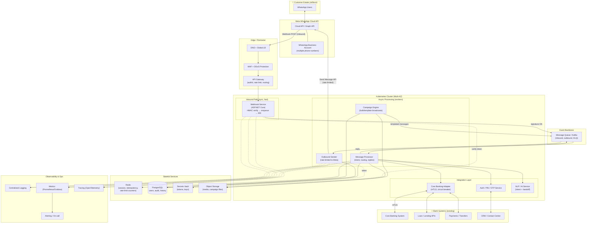
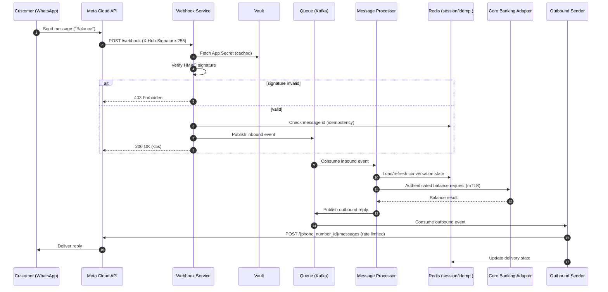
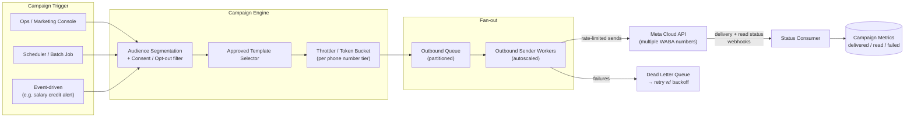
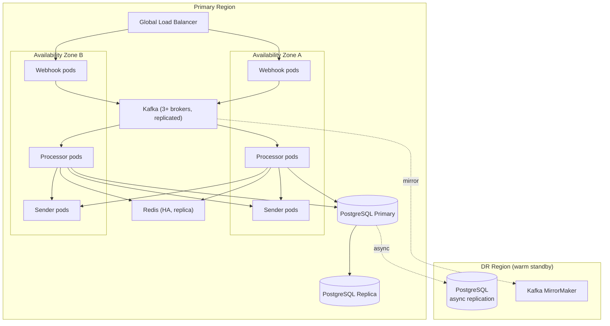
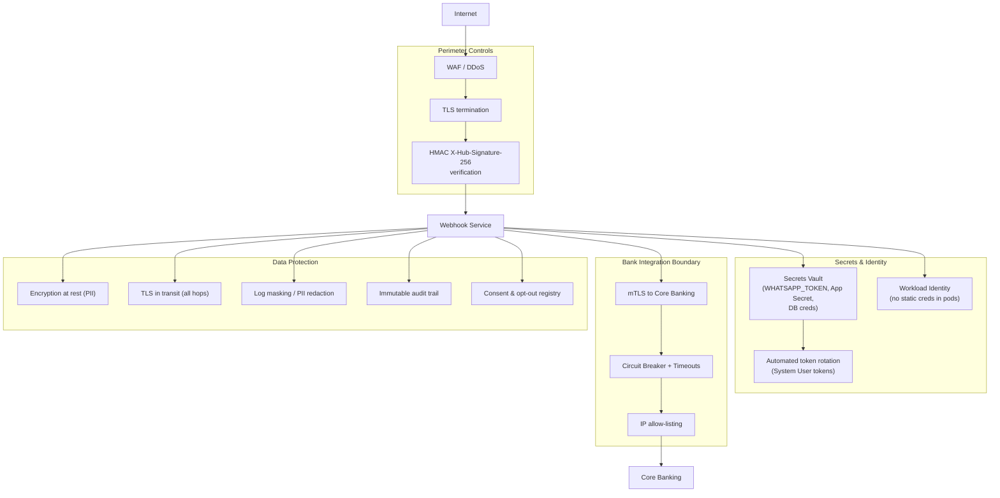
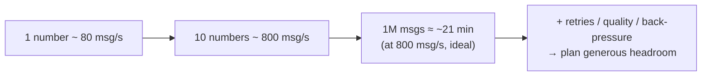

# Production System Architecture — WhatsApp Banking Bot

> **Audience:** Engineering, Platform, and Security teams of a banking partner
> operating WhatsApp messaging across a customer base in the **millions**.
>
> This document describes the **target production architecture**. The current
> repository is an MVP/POC (a single ASP.NET Core service: webhook verify,
> inbound handling, and outbound send). The diagrams below show how that core
> evolves into a horizontally scalable, secure, regulated-grade platform.

---

## 1. Design Goals & Constraints

| Concern | Target |
| --- | --- |
| **Scale** | Millions of customers; bursty inbound + large outbound campaigns |
| **Throughput** | Bounded by Meta Cloud API messaging tier (e.g. 80 → 1,000 msg/s per number; multiple numbers via WABA) |
| **Latency** | Acknowledge Meta webhook in < 5s (Meta retries otherwise); async processing for everything else |
| **Availability** | Multi-AZ, active-active stateless services; target 99.95%+ |
| **Security** | Zero secrets in code; HMAC verification; mTLS to core banking; PII encryption |
| **Compliance** | Audit trail, data residency, consent management, opt-out handling |
| **Reliability** | At-least-once delivery, idempotency, retries with backoff, DLQ |

> **Key architectural principle:** the public webhook path does the *minimum*
> (verify signature → enqueue → 200 OK). All business logic, core-banking
> calls, and outbound sends happen **asynchronously** behind queues.

---

## 2. High-Level Production Architecture

---

## 3. Inbound Message Flow (Customer → Bank)

The hot path is intentionally thin so Meta always gets a fast `200 OK`.

---

## 4. Outbound Broadcast / Campaign Flow (Bank → Millions)

Bulk messaging to millions must respect Meta template rules, per-number
throughput tiers, opt-out/consent, and back-pressure.

**Scaling levers for millions of recipients:**

- **Multiple phone numbers** under one or more WABAs to multiply aggregate throughput.
- **Queue partitioning** by recipient hash for parallel, ordered-per-user delivery.
- **Token-bucket throttling** per number to stay within Meta's messaging tier (auto-upgrades as quality rating allows).
- **Horizontal autoscaling** of sender workers driven by queue depth.
- **Back-pressure + DLQ** so transient Meta/network failures retry without data loss.
- **Consent & opt-out enforcement** applied *before* fan-out (regulatory requirement).

---

## 5. Deployment Topology (Multi-AZ / DR)

---

## 6. Security & Compliance Architecture

**Banking-grade safeguards:**

- **HMAC signature validation** on every inbound webhook (reject spoofed payloads).
- **Secrets in a vault**, never in `.env`/images; **workload identity** for pod auth.
- **mTLS + IP allow-listing + circuit breakers** on all core-banking calls.
- **PII encryption** at rest, **log redaction**, and an **immutable audit trail** for every customer interaction.
- **Consent / opt-out registry** enforced before any outbound message.
- **Long-lived System User tokens** with automated rotation (no 24h temp tokens).

---

## 7. Mapping: MVP (this repo) → Production

| MVP Component (current) | Production Evolution |
| --- | --- |
| `WebhookController` (verify + handle inline) | Thin **Webhook Service**: HMAC verify → enqueue → 200 |
| `WhatsAppService.HandleIncomingMessage` | **Message Processor** workers consuming from Kafka |
| `WhatsAppService.GenerateReply` (if/else) | **NLP/Intent service** + rules engine + human handoff |
| `WhatsAppService.SendWhatsAppMessage` | **Outbound Sender** workers with token-bucket rate limiting |
| `.env` config | **Secrets Vault** + validated config + rotation |
| In-memory / none | **Redis** (session, idempotency) + **PostgreSQL** (audit, history) |
| Single container | **Kubernetes**, multi-AZ, autoscaled, with DR region |
| `ILogger` console | **Structured logs + metrics + tracing + alerting** |
| Direct synchronous send | **Kafka-backed async** with retries + DLQ |
| n/a | **Campaign Engine** for bulk/template broadcasts to millions |

---

## 8. Throughput Planning Notes

- Meta enforces **per-phone-number messaging limits** tied to quality rating
  (commonly 1K → 10K → 100K → unlimited business-initiated conversations/24h,
  and an API call rate of ~80 msg/s, upgradable). Plan capacity by
  **(numbers × per-number rate)** and partition queues accordingly.
- For a campaign to **N million** recipients, estimate wall-clock time as
  `N / (numbers × msg_per_sec)` and add headroom for retries/back-pressure.
- Keep **business-initiated** (template) vs **user-initiated** (session)
  messaging separate — they have different rules, costs, and rate envelopes.

